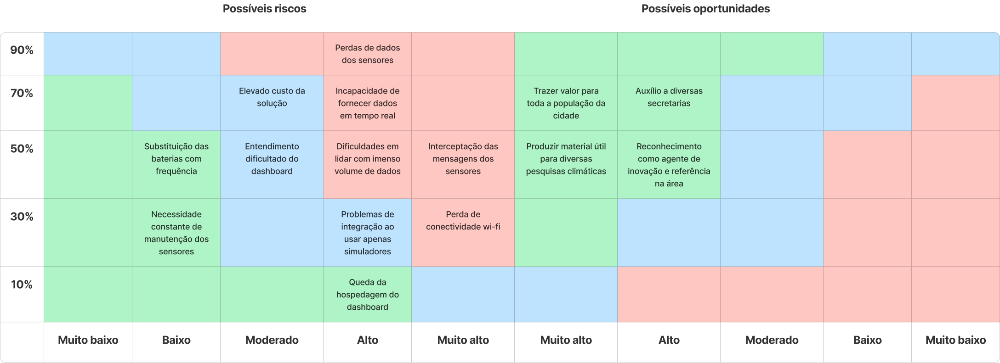

## Estratégias de Mitigação de Riscos

**1. Perda de dados dos sensores**: Utilização de backup dos dados e redundância de armazenamento.

**2. Elevado custo da solução**: Utilização de sensores mais baratos, porém com qualidade aceitável.

**3. Incapacidade de fornecer dados em tempo real**: Fornecimento de dado no menor tempo possível.

**4. Substituição das baterias com frequência**: Utilização de baterias recarregáveis e com maior durabilidade.

**5. Entendimento dificultado do dashboard**: Realização de testes de usabilidade e feedbacks com os usuários.

**6. Dificuldades em lidar com imenso volume de dados**: Utilização de ferramentas de Big Data e Cloud Computing.

**7. Interceptação das mensagens dos sensores**: Preocupação com a segurança dos dados e utilização de protocolos de segurança.

**8. Necessidade constante de manutenção dos sensores**: Utilização de sensores mais resistentes e com maior durabilidade.

**9. Problemas de integração ao usar apenas simuladores**: Testes com sensores reais e integração com o sistema.

**10. Perda de conectividade wi-fi**: Utilização de armazenamento local e envio dos dados quando a conexão for restabelecida.

**11. Queda da hospedagem do dashboard**: Utilização de serviços de hospedagem confiáveis.
