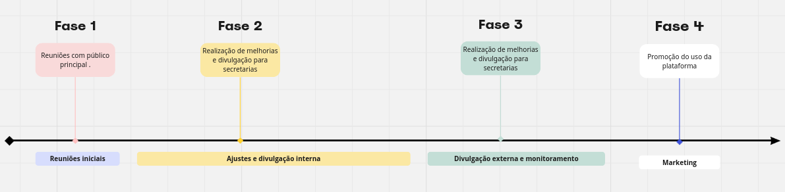

# Plano de Comunicação

Um plano de comunicação é uma estratégia detalhada que delineia como uma organização ou projeto planeja transmitir informações importantes para seu público-alvo. É uma ferramenta essencial para garantir que as mensagens certas sejam entregues aos públicos certos, nos momentos certos e pelos canais certos. No contexto do projeto proposto para alertar a população de São Paulo sobre os níveis de poluição e aspectos ambientais urbanos, o plano de comunicação desempenha um papel fundamental na sensibilização e mobilização tanto da comunidade em geral quanto dos gestores públicos. Além disso, o plano de comunicação identifica o público-alvo, destacando quem são as principais audiências a serem alcançadas, para quem as mensagens serão adaptadas de acordo com suas necessidades e interesses. As mensagens-chave são os pontos centrais que serão comunicados. Os canais de comunicação referem-se aos meios pelos quais as mensagens serão transmitidas. Por fim, o cronograma estabelece os prazos e etapas para implementação do plano, garantindo que as mensagens sejam entregues nos momentos certos e pelos canais mais eficazes. Esses elementos se combinam para garantir que as informações certas sejam entregues aos públicos certos, de forma a alcançar os objetivos do projeto de maneira eficaz.

## Definição do Propósito

Espera-se que a população da cidade de São Paulo seja alertada acerca dos níveis de poluição e aspectos ambientais urbanos do momento a fim de preservar a saúde e bem estar dessa. Além disso, espera-se que gestores públicos monitorem constantemente a situação ambiental para que ações das secretarias públicas sejam mais específicas e efetivas objetivando dessa forma redução de gastos excessivos para resolver esses problemas relacionados ao ambiente urbano paulista. Adicionalmente, os acadêmicos que estudam essa temática desempenham um papel crucial no fornecimento de análises aprofundadas, pesquisas e soluções inovadoras. Seu envolvimento e contribuição para o desenvolvimento de políticas baseadas em evidências são fundamentais para enfrentar os desafios ambientais complexos da cidade, fornecendo insights valiosos e perspectivas especializadas que podem informar tanto a população quanto os gestores públicos em suas tomadas de decisão.

## Público alvo

É essencial compreender a dinâmica de diferentes grupos dentro da sociedade paulistana, especialmente as secretarias municipais, a população em geral e os acadêmicos especializados em meio ambiente. Para as secretarias, a plataforma proposta oferece uma oportunidade única de acesso a dados detalhados e atualizados, permitindo uma abordagem mais informada e estratégica na gestão ambiental da cidade. Essas informações são cruciais para embasar decisões e políticas públicas que visam ao desenvolvimento sustentável e à melhoria da qualidade de vida dos cidadãos. Além disso, ao incentivar o engajamento ativo da população na plataforma, busca-se criar uma sinergia entre os cidadãos e as autoridades municipais, transformando os habitantes de São Paulo em agentes de mudança e fortalecendo a democracia participativa. Por outro lado, os acadêmicos especializados em meio ambiente desempenham um papel importante como fontes de conhecimento e expertise, contribuindo para o aprimoramento contínuo das políticas e práticas ambientais da cidade. Portanto, ao considerar as necessidades e interesses desses diferentes públicos, o plano de comunicação busca promover uma colaboração eficaz e multifacetada para enfrentar os desafios ambientais de São Paulo.

## Mensagens chave

As principais informações a serem transmitidas serão dados com informações e explicações que apontam a qualidade do ar em determinada região de São Paulo a partir de valores que indiquem a quantidade de CO2 (Dióxido de Carbono), CO (Monóxido de Carbono), NO2 (Dióxido de Nitrogênio), Partículas Inaláveis e Partículas Inaláveis Finas. Além disso, escalando o projeto para detecção de outros aspectos ambientais, informações acerca do ruído urbano, radiação solar, luminosidade, umidade do ar e gestão de resíduos com indicadores parametrizados ainda a serem definidos poderão ser incluídos.

A disponibilização de dados para a população, secretarias e acadêmicos seguirá abordagens distintas, alinhadas às necessidades e capacidades de cada grupo. Para a população em geral, os dados serão apresentados de forma simplificada e acessível, através da interface da aplicação desenvolvida, onde serão exibidos indicadores claros e compreensíveis sobre a qualidade do ar e outros aspectos ambientais. Essa abordagem visa garantir que os cidadãos possam facilmente compreender as condições ambientais em suas regiões e tomar medidas adequadas, como evitar áreas com altos níveis de poluição.

Para os acadêmicos especializados em meio ambiente e para as secretarias municipais responsáveis pela gestão ambiental da cidade de São Paulo, a disponibilização de dados será uma ferramenta fundamental para a análise e tomada de decisões embasadas. Enquanto os acadêmicos terão acesso a conjuntos de dados brutos e ferramentas analíticas avançadas, permitindo estudos aprofundados e pesquisas científicas sobre os diversos aspectos ambientais da cidade, as secretarias terão acesso a informações detalhadas e parametrizadas, capacitando-as a identificar áreas problemáticas, implementar políticas direcionadas e monitorar o progresso ao longo do tempo. Essa abordagem integrada visa não apenas promover a colaboração entre academia e governo, mas também contribuir para o desenvolvimento de políticas mais eficazes e sustentáveis, visando ao bem-estar e à qualidade de vida dos cidadãos paulistanos.

## Canais de Comunicação

Por meio da criação de uma aplicação com interface dashboard onde as informações com métricas apontando os níveis de poluição e indicadores da situação atmosférica e de poluição filtrada por região da cidade. Esse serviço será vinculado à aparelhos mobile e desktop para interação dos usuários com a interface. Além disso, serão implementados planos de comunicação estratégicos que visam chamar a atenção da população por meio de diversos canais, incluindo redes sociais como Facebook, Twitter e Instagram, onde serão compartilhadas atualizações regulares sobre os níveis de poluição e dicas para ações individuais de mitigação. Para alcançar as secretarias municipais e acadêmicos, poderão ser utilizados canais de comunicação mais tradicionais, como e-mails institucionais, boletins informativos e workshops específicos sobre os dados e análises disponibilizados pela aplicação. Essa abordagem multicanal garantirá que as informações cheguem aos diferentes públicos-alvo de maneira eficaz e oportuna, promovendo uma maior conscientização e engajamento com as questões ambientais em São Paulo.

## Cronograma

1. Reuniões Iniciais com Secretarias: Iniciar o processo de comunicação abordando o público principal, as secretarias municipais responsáveis pela gestão ambiental, apresentando a aplicação e recolhendo feedbacks para ajustes necessários.

2. Implementação de Ajustes: Realizar as modificações e melhorias na plataforma com base nos feedbacks recebidos das secretarias, garantindo que suas necessidades sejam atendidas de forma eficaz.

3. Divulgação Interna para Secretarias: Após a implementação dos ajustes, realizar uma divulgação interna para as secretarias municipais através da intranet e e-mails institucionais, informando sobre o lançamento interno da plataforma e seus objetivos.

4. Divulgação Externa para a População: Após o lançamento interno e a garantia da eficácia da plataforma, realizar a divulgação externa para o restante da população de São Paulo. Utilizar os meios de comunicação mais acessados pela população, como redes sociais, rádio e televisão, para ampliar o alcance da mensagem.

5. Monitoramento de Mídia e Opinião Pública: Estabelecer um sistema de monitoramento de mídia e opinião pública para acompanhar as menções à plataforma e identificar tendências e feedbacks relevantes para futuras melhorias.

6. Continuação das Campanhas de Marketing: Após o lançamento, manter as campanhas de marketing e comunicação para promover o uso contínuo da plataforma. Destacar casos de sucesso e incentivar a participação ativa dos cidadãos e das secretarias, garantindo a sustentabilidade e relevância contínua da iniciativa.

## Conclusão

Por fim, este plano de comunicação visa desempenhar um papel crucial na promoção da conscientização ambiental e na mobilização para ações concretas em prol da qualidade de vida em São Paulo. Ao fornecer informações detalhadas e em tempo real sobre os níveis de poluição e outros aspectos ambientais, buscamos capacitar tanto os cidadãos quanto os gestores públicos a tomar medidas informadas e proativas para mitigar os impactos negativos no meio ambiente urbano. Através da implementação de uma aplicação de fácil acesso e da disponibilização de dados precisos, esperamos catalisar uma mudança positiva na forma como a comunidade interage e se engaja com questões ambientais, visando um futuro mais sustentável e saudável para todos os habitantes da cidade de São Paulo.
