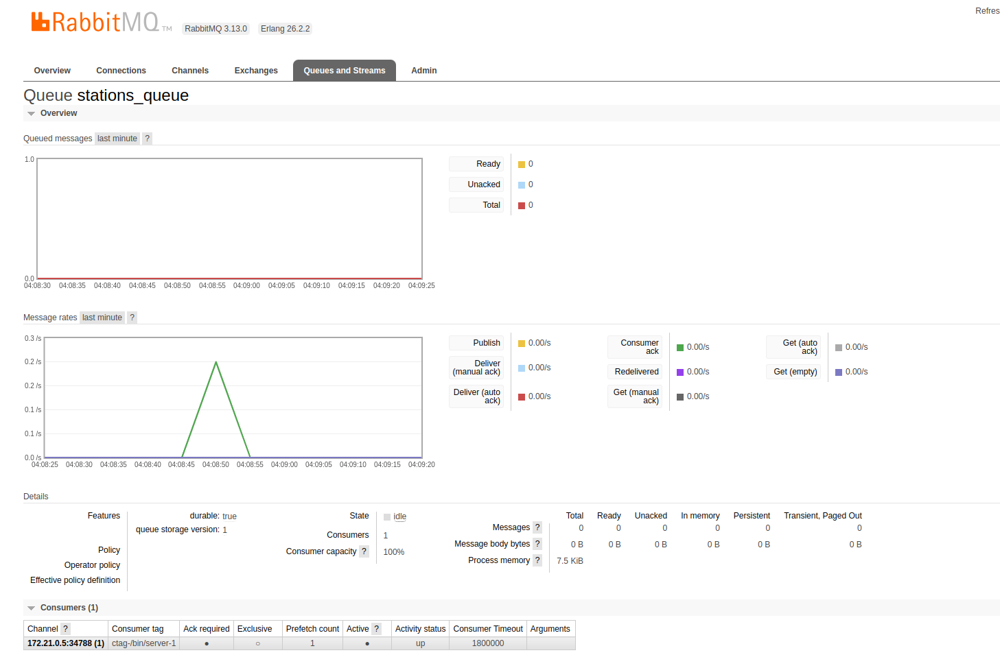

# Estrutura de Integração - Broker, Mensageria e Banco de Dados


## Descrição
Este código é parte de uma aplicação que captura dados de sensores em uma estação e os envia para um broker MQTT, onde são então processados e inseridos em um banco de dados PostgreSQL.

## Pacotes Importados
O código importa os seguintes pacotes:
- `context`: Para gerenciar contexto de execução.
- `database/sql`: Para interagir com o banco de dados SQL.
- `encoding/json`: Para codificar e decodificar dados JSON.
- `fmt`, `log`, `os`, `os/signal`, `syscall`: Pacotes padrão para formatação, logging, manipulação de sinais e operações de sistema.
- `github.com/Inteli-College/2024-T0002-EC09-G04/backend/pkg/station`: Pacote personalizado que lida com a conexão MQTT.
- `github.com/eclipse/paho.mqtt.golang`: Cliente MQTT para comunicação com o broker MQTT.
- `github.com/lib/pq`: Driver PostgreSQL para interagir com o banco de dados PostgreSQL.
- `github.com/rabbitmq/amqp091-go`: Pacote para interagir com o RabbitMQ.

## Estrutura do Código
O código consiste em várias funções e tipos de dados para processar e enviar dados de sensores para o broker MQTT e, em seguida, para o banco de dados PostgreSQL.

- `GasData`, `RadLumData`, `Data`: Tipos de dados usados para representar informações dos sensores.
- `onMessageReceived`: Função de callback chamada quando uma mensagem é recebida do broker MQTT.
- `failOnError`: Função auxiliar para lidar com erros de maneira uniforme.
- `sendToRabbitMQ`: Função para enviar dados recebidos do broker MQTT para o RabbitMQ e, em seguida, processá-los e inseri-los no banco de dados PostgreSQL.
- `insertGasAndRadLumData`: Função para inserir dados de gás e radiação/luminosidade no banco de dados PostgreSQL.
- `main`: Função principal que configura e inicia a conexão MQTT, subscreve-se a um tópico e espera por sinais de término para encerrar graciosamente.

## Configuração e Tecnologias Utilizadas
- **Linguagem de Programação:** Go (Golang)
- **Pacotes de Terceiros:**
  - `github.com/Inteli-College/2024-T0002-EC09-G04/backend/pkg/station`: Pacote personalizado para manipulação de conexão MQTT.
  - `github.com/eclipse/paho.mqtt.golang`: Cliente MQTT para comunicação com o broker MQTT.
  - `github.com/lib/pq`: Driver PostgreSQL para interagir com o banco de dados PostgreSQL.
  - `github.com/rabbitmq/amqp091-go`: Pacote para interagir com o RabbitMQ.

## Arquitetura de Comunicação de Dados

### Componentes:

1. **MQTT com Broker em Cloud:**
   - O código utiliza a biblioteca `github.com/eclipse/paho.mqtt.golang` para comunicação MQTT.
   - O broker MQTT usado é o HiveMQ, hospedado na nuvem em `ssl://908447a66faf43129ef280ff434012e6.s1.eu.hivemq.cloud:8883/mqtt:1883`.
   - O programa se conecta ao broker MQTT e se inscreve no tópico `/stations` para receber mensagens enviadas pelas estações.

2. **Etapas do RabbitMQ:**
   - Quando uma mensagem é recebida do broker MQTT, ela é enviada para o RabbitMQ.
   - A função `sendToRabbitMQ` é responsável por estabelecer uma conexão com o RabbitMQ e enviar a mensagem para uma fila chamada `stations_queue`.
   - Após enviar a mensagem, o programa aguarda por mensagens na fila `stations_queue`. Quando uma mensagem é recebida, ela é processada e os dados são inseridos no banco de dados PostgreSQL.



3. **Integração com Database:**
   - O código utiliza a biblioteca `database/sql` para interagir com o banco de dados PostgreSQL.
   - A função `insertGasAndRadLumData` insere os dados de gás e radiação/luminosidade no banco de dados.
   - Primeiro, ela estabelece uma conexão com o banco de dados PostgreSQL, usando a URL de conexão especificada.
   - Em seguida, prepara e executa as consultas SQL necessárias para inserir os dados nas tabelas `Gas` e `Rad_Lum`.
   - Os dados de gás são inseridos na tabela `Gas`, enquanto os dados de radiação/luminosidade são inseridos na tabela `Rad_Lum`.


### Principal Componente - Consumer

Um dos componentes do back-end do sistema é caracterizado por agir como um consumidor dos dados produzidos. Uma vez que os dados recebidos pelo broker são enfileirados pelo RabbitMQ, o consumer estabelece conexão com o RabbitMQ, consome os dados da fila, desenfileirando-os e, por fim, popula o banco de dados PostgreSQL instanciado no RDS.

#### Arquitetura e Fluxo de Dados

1. **Recebimento de Mensagens MQTT**: Inicializa uma conexão MQTT e se inscreve em um tópico específico para receber mensagens de dados de estações.
2. **Envio para RabbitMQ**: As mensagens MQTT recebidas são enviadas para uma fila no RabbitMQ.
3. **Consumo e Processamento de Mensagens**: O aplicativo consome mensagens da fila RabbitMQ, processa os dados JSON e insere os registros no banco de dados PostgreSQL.


#### Funções

- `messagePubHandler`: Função para lidar com mensagens MQTT recebidas.
- `failOnError`: Auxiliar para tratamento de erros.
- `insertGasData`: Insere dados no banco de dados PostgreSQL.
- `sendToRabbitMQ`: Envia mensagens recebidas para uma fila no RabbitMQ.
- `main`: Inicializa a conexão MQTT, configura o tratamento de mensagens e se inscreve em um tópico.

## Execução
Para executar todo sistema de backend, incluindo banco de dados e sistema de API para o armazenamento dos dados, basta acessar a pasta raiz do sistema e rodar o seguinte comando: 
```
docker compose up --build
```
