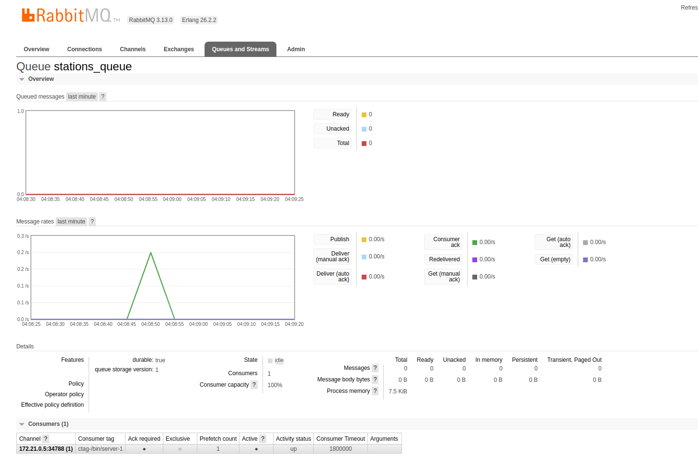

# Sistema de Mensageria com RabbitMQ

## Conceitos Principais:

1. **Queue (Fila):**
   - Uma fila é um local de armazenamento temporário onde as mensagens são mantidas até que sejam consumidas por um aplicativo.
   - As filas no RabbitMQ funcionam com o modelo de "first-in, first-out" (FIFO), ou seja, as mensagens são entregues na ordem em que foram recebidas.

2. **Publish (Publicação):**
   - O publish é o ato de enviar uma mensagem para uma fila no RabbitMQ.
   - Os produtores de mensagens, também conhecidos como publishers, são responsáveis por publicar mensagens em filas específicas no RabbitMQ.

3. **Consumer (Consumidor):**
   - O consumer é o componente que recebe e processa as mensagens de uma fila.
   - Os consumidores de mensagens, também conhecidos como subscribers ou workers, são responsáveis por consumir mensagens de filas específicas no RabbitMQ.

4. **QoS (Quality of Service):**
   - O QoS define o nível de garantia de entrega das mensagens entre produtores e consumidores.
   - No RabbitMQ, o QoS pode ser configurado ao consumir mensagens de uma fila, especificando o número máximo de mensagens que o consumidor irá processar de cada vez.

## Funcionamento:

1. **Publicação de Mensagens (Publish):**
   - O publish é realizado pelos produtores de mensagens, que se conectam ao RabbitMQ e enviam mensagens para filas específicas.
   - As mensagens são enviadas para o RabbitMQ através de canais de comunicação, onde são roteadas para as filas correspondentes.

2. **Consumo de Mensagens (Consume):**
   - O consumo de mensagens é realizado pelos consumidores de mensagens, que se conectam ao RabbitMQ e recebem mensagens de filas específicas.
   - Os consumidores podem ser configurados para processar as mensagens de acordo com a demanda do aplicativo, realizando operações como processamento de dados, geração de relatórios, etc.

   

3. **Garantia de Entrega e Persistência:**
   - O RabbitMQ oferece garantias de entrega de mensagens, o que significa que as mensagens publicadas em uma fila serão entregues a pelo menos um consumidor.
   - As mensagens podem ser persistidas em disco para garantir que não sejam perdidas em caso de falha ou reinicialização do RabbitMQ.
   - O QoS pode ser configurado para garantir que as mensagens sejam processadas com sucesso antes de serem removidas da fila.

## Acesso ao Dashboard do RabbitMQ:

- O RabbitMQ fornece um dashboard web que permite monitorar e gerenciar o servidor RabbitMQ.
- Para acessar o dashboard, abra um navegador da web e navegue para o endereço: `http://localhost:15672`.
- Você será solicitado a fazer login. O nome de usuário padrão é `guest` e a senha padrão também é `guest`.
- Após fazer login, você poderá visualizar informações sobre as filas, conexões, trocas, entre outros aspectos do servidor RabbitMQ.

