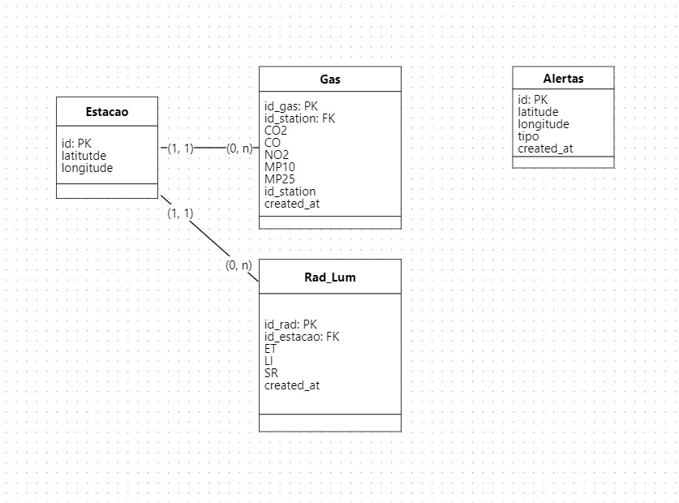

# Banco de Dados

## Introdução

 O sistema de monitoramento ambiental em São Paulo simula sensores que coletam informações sobre condições ambientais, como temperatura, radiação e poluição. Esses dados são transmitidos em tempo real através do protocolo MQTT para um broker RabbitMQ e, em seguida, consumidos por um aplicativo que os armazena em um banco de dados PostgreSQL. Dessa maneira, inicialmente, um banco de dados relacional foi desenvolvido e armazenado na AWS-RDS com o objetivo de registrar dados ambientais em diferentes áreas da cidade de São Paulo para análise e tomada de decisões posteriormente pelos usuários do sistema.

### Estrutura do Banco de Dados

O banco de dados é composto por várias tabelas que armazenam diferentes tipos de informações, incluindo dados dos sensores, localizações e alertas da população sobre eventos ambientais. As principais tabelas incluem:

**1. Tabela `Estacao`**

Esta tabela armazena informações sobre as estações de monitoramento, incluindo sua localização geográfica.

|Coluna|Tipo|Descrição|
|------|----|---------|
|Id    | INT| Primary Key|
|Latitude|FLOAT|Latitude da estação|
|Longitude|FLOAT|Longitude da estação|

**2. Tabela `Gas`**

Esta tabela armazena dados dos sensores de poluição, como CO2, CO, NO2, MP10 e MP25.

|Coluna|	Tipo|	Descrição|
|------|--------|------------|
|Id_gas|	INT|	Chave primária do sensor de gás|
|Id_estacao|	INT|	Chave estrangeira referenciando a tabela Estacao|
|CO2	|FLOAT	|Concentração de CO2 (dióxido de carbono)|
|CO	|FLOAT	|Concentração de CO (monóxido de carbono)|
|NO2	|FLOAT	|Concentração de NO2 (dióxido de nitrogênio)|
|MP10	|FLOAT	|Partículas de Material Particulado (diâmetro < 10μm)|
|MP25	|FLOAT	|Partículas de Material Particulado (diâmetro < 2.5μm)|

**3.Tabela `Rad_lum`**

Esta tabela armazena dados dos sensores de radiação e luminosidade.

|Coluna	|Tipo|	Descrição|
|-------|----|-----------|
|Id_rad	|INT|	Chave primária do sensor de radiação e luminosidade|
|Id_estacao|	INT|	Chave estrangeira referenciando a tabela Estacao|
|ET	|FLOAT|	Evapotranspiração|
|LI|FLOAT|	Índice de Luminosidade|
|SR|FLOAT|	Radiação Solar|

**4. Tabela `Alertas`**

Esta tabela armazena os alertas recebidos da população sobre eventos ambientais, como alagamentos, deslizamentos, incêndios, obras ou acidentes.

|Coluna|	Tipo|	Descrição|
|------|--------|------------|
|Id_alerta|	SERIAL|	Chave primária autoincrementada do alerta|
|latitude|	FLOAT|	Latitude do evento|
|longitude|	FLOAT|	Longitude do evento|
|tipo|	VARCHAR|	Tipo do evento (alagamento, deslizamento, incêndio, obra, acidente)|
|data|	TIMESTAMP|	Data de criação do alerta|

### Relação com o sistema

Indubitavelmente, a relação do banco de dados com o restante do sistema é fundamental para garantir a integridade, persistência e acessibilidade dos dados coletados pelos sensores e alertas da população. Tendo isso em vista, é necessário compreender o fluxo das informações dentro do sistema para uma compreensão mais completa do funcionamento do sistema de armazenamento de dados atual.

Primeiramente, os dados enviados pelos sensores são enfileirados no broker RabbitMQ utilizando o protocolo MQTT. O RabbitMQ atua como um intermediário eficiente para receber, armazenar temporariamente e encaminhar os dados para os consumidores.
Um consumidor, ou consumer, é responsável por desenfileirar os dados do RabbitMQ. Este consumidor é um componente do sistema desenvolvido em Golang para interação com o resto do sistema. O consumidor é responsável por retirar os dados da fila e processá-los para posterior armazenamento no banco de dados. Uma vez armazenados no banco de dados, os dados estão disponíveis para análise e visualização na AWS-RDS. Assim, após o consumo desses dados por dashboards, os usuários do sistema podem acessar essas informações para entender as condições ambientais em diferentes áreas da cidade de São Paulo ao longo do tempo.

### Modelo Lógico do Banco de dados

O modelo lógico do banco de dados oferece uma representação organizada e eficiente das informações coletadas pelo sistema de monitoramento ambiental em São Paulo. Ele foi projetado para atender às necessidades de armazenamento, recuperação e análise de dados ambientais, fornecendo uma base sólida para tomada de decisões e ações por parte das autoridades responsáveis pelo meio ambiente.

## Banco de Dados da Aplicação

O banco de dados da aplicação do Metabase é usado para armazenar diversas informações necessárias para o funcionamento da própria aplicação. Isso inclui configurações, dados de usuários, logs, histórico de consultas e outras informações relacionadas ao funcionamento do Metabase como um todo.

Para isso, criamos um endpoint de um Banco de Dados Relacional no RDS da Amazon. Apenas para o armazenamento e configuração da interface do metabase se manter constante para podermos trabalhar na aplicação.

### Funcionamento

1. Armazenamento de Configurações: O banco de dados armazena configurações da aplicação, como preferências do usuário, configurações de conexão com fontes de dados, configurações de visualização e outras opções de personalização.

2. Gestão de Usuários: Informações sobre os usuários registrados, incluindo nome, e-mail, permissões de acesso e outras informações relevantes, são armazenadas no banco de dados da aplicação.

3. Histórico de Consultas: O Metabase registra o histórico de consultas realizadas pelos usuários, armazenando informações sobre consultas executadas, resultados obtidos e outros dados relacionados.

4. Logs e Monitoramento: Logs de atividades, erros, alertas e outras mensagens de registro são armazenados no banco de dados da aplicação para fins de monitoramento, depuração e auditoria.

5. Cache e Metadados de Consulta: O Metabase pode armazenar em cache resultados de consultas e metadados sobre as fontes de dados para melhorar o desempenho e a eficiência das consultas subsequentes.

## Conclusão

A estrutura do banco de dados inicial foi projetada para armazenar eficientemente uma grande quantidade de dados, permitindo uma análise abrangente e ação rápida em resposta para integração com o sistema.
