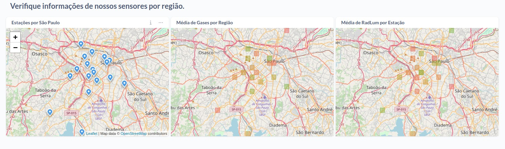
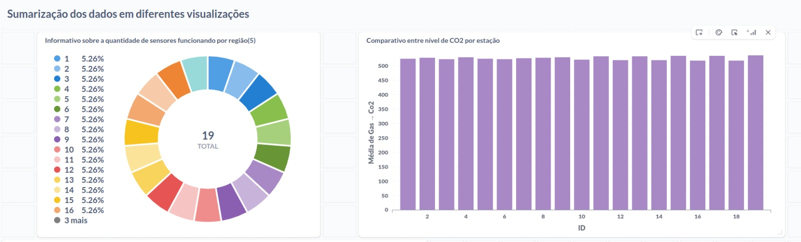
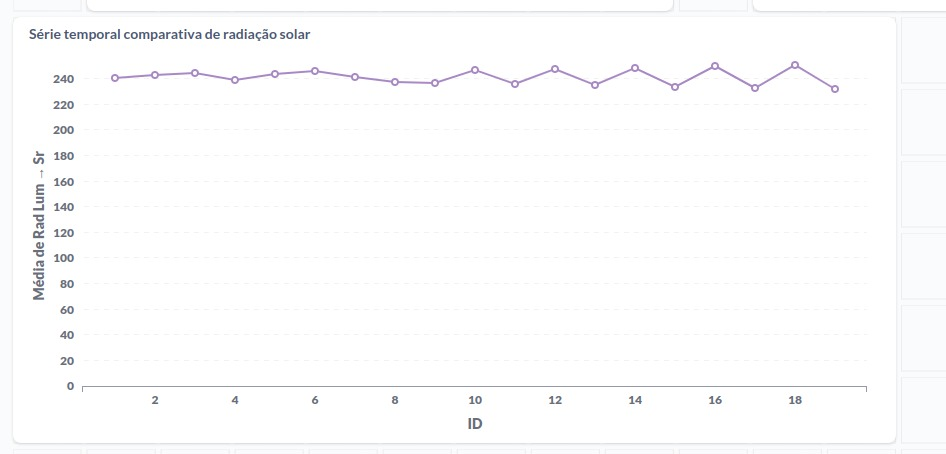

# Dashboard Metabase

Um dashboard é uma ferramenta de interface gráfica que apresenta informações de maneira visual e concisa, geralmente através de gráficos, tabelas e outros elementos visuais. É utilizado principalmente em negócios e organizações para monitorar métricas importantes, analisar dados complexos e tomar decisões estratégicas com base nessas informações.

O Metabase é uma ferramenta de software de código aberto projetada para criar e compartilhar dashboards e análises de dados de forma intuitiva e acessível. Ele é especialmente útil para empresas que desejam explorar e visualizar dados sem a necessidade de conhecimentos avançados em programação ou SQL.

Com o Metabase, os usuários podem conectar-se a diversas fontes de dados, como bancos de dados relacionais, armazenamentos em nuvem e arquivos CSV. A partir dessas fontes, eles podem criar consultas, gráficos e painéis interativos para visualizar e analisar os dados de maneira eficaz.

Dessa forma, o grupo concluiu que o dashboard da sprint 1 seria uma etapa de validação, visando compreender quais visualizações são mais cruciais para os usuários da plataforma e como implementá-las. A ênfase principal desta fase seria realizar testes para avaliar a intuitividade das visualizações e outras questões pertinentes.

Além disso, o grupo planeja uma personalização mais profunda do frontend, integrando o Metabase com uma interface desenvolvida internamente. Isso permitiria uma maior adaptação às necessidades específicas da Prodam e proporcionaria aos colaboradores uma sensação de familiaridade com a interface.

O dashboard inicial foi projetado para atender a uma variedade de usuários, desde os finais até os gestores. Dividido em duas abas, uma para comparações geográficas e outra para uma visão sumarizada dos dados, essa abordagem visa validar junto aos parceiros quais visualizações são mais úteis e como refiná-las para atender às demandas específicas dos usuários.

## Dashboard 1: Comparações geográficas

O Dashboard 1 apresenta visualizações destinadas à comparação geográfica e monitoramento de dados em São Paulo. Na primeira aba, são exibidos três gráficos distintos. O primeiro gráfico consiste em um mapa mostrando a localização de todos os sensores, utilizando coordenadas de latitude e longitude. Seu propósito é verificar a operação dos sensores, permitindo identificar se estão funcionando corretamente.

O segundo gráfico visa mostrar a média de gases em diferentes regiões de São Paulo. Este gráfico serve como um guia para os gestores na alocação de recursos, ajudando a decidir em qual região da cidade concentrar esforços.

Similarmente, o terceiro gráfico tem o objetivo de mostrar a poluição luminosa e a radiação em diferentes regiões de São Paulo, também para auxiliar na tomada de decisões estratégicas.

## Dashboard 2: Sumarização dos dados

Na segunda aba, intitulada "Sumarização dos Dados", são apresentadas mais três visualizações. O primeiro gráfico representa a quantidade de sensores inativos por macroregião de São Paulo (leste, sul, oeste e centro). Essa visualização permite um comparativo entre as regiões, identificando aquelas com maior número de sensores inativos e as estações mais comprometidas. O objetivo é fornecer aos gestores uma visão clara da situação para promover campanhas de conscientização e fortalecer as estações de coleta de dados.

O segundo gráfico apresenta um comparativo entre os gases monitorados em cada estação. Essa visualização ajuda a identificar as estações mais preocupantes em relação a cada gás, possibilitando a adoção de medidas corretivas, como reflorestamento em áreas com alta concentração de CO2.

Por fim, o último gráfico é uma série temporal que demonstra a variação dos diferentes tipos de poluição ao longo do tempo. Essa visualização é útil para entender como os dados foram afetados por mudanças ao longo do tempo, como aconteceu durante a pandemia, por exemplo.

Esses dashboards foram projetados para fornecer insights valiosos aos gestores da Prodam, ajudando-os a tomar decisões informadas e aprimorar a eficácia das operações relacionadas à cidade inteligente em São Paulo.

