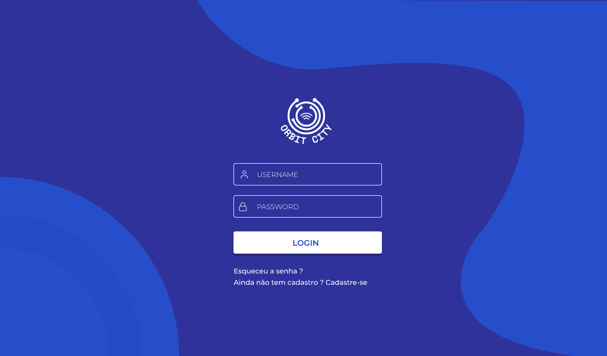
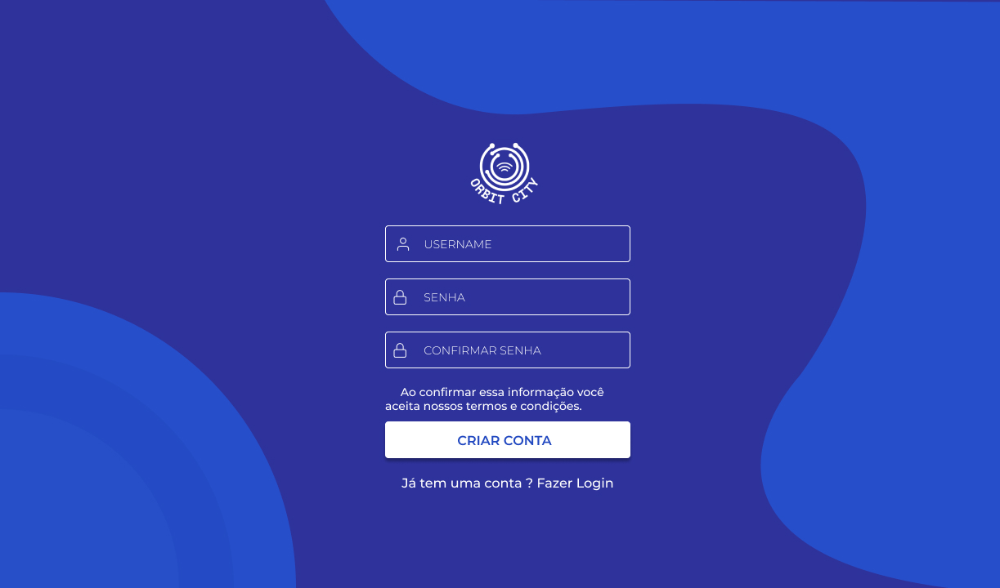
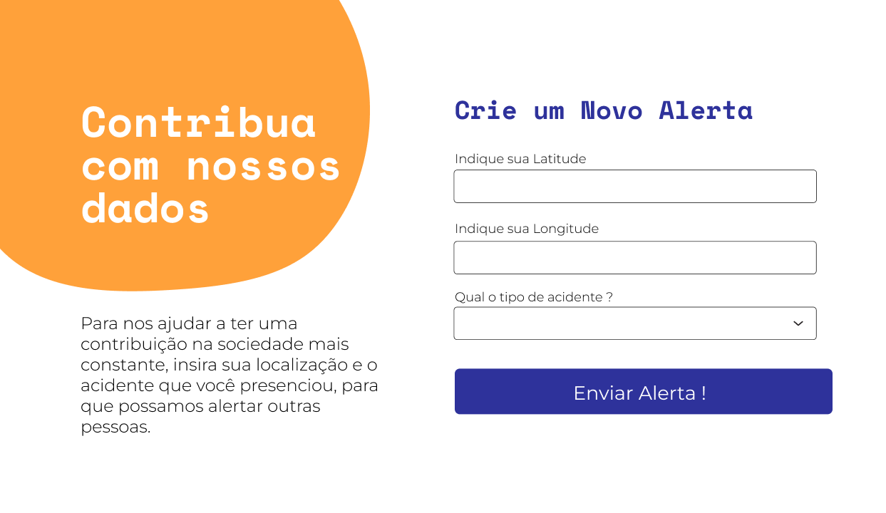
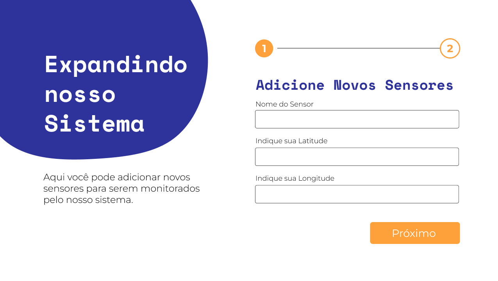
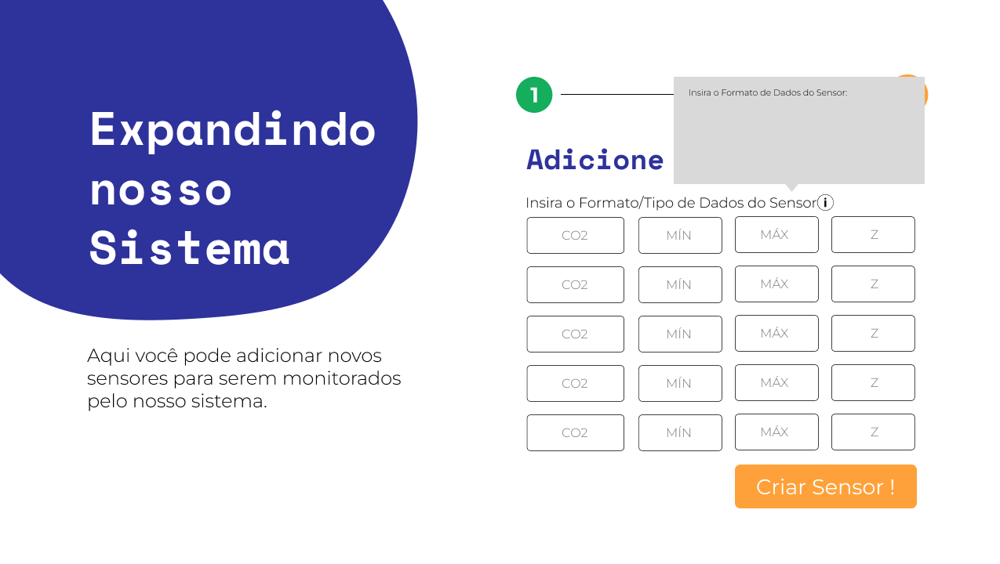
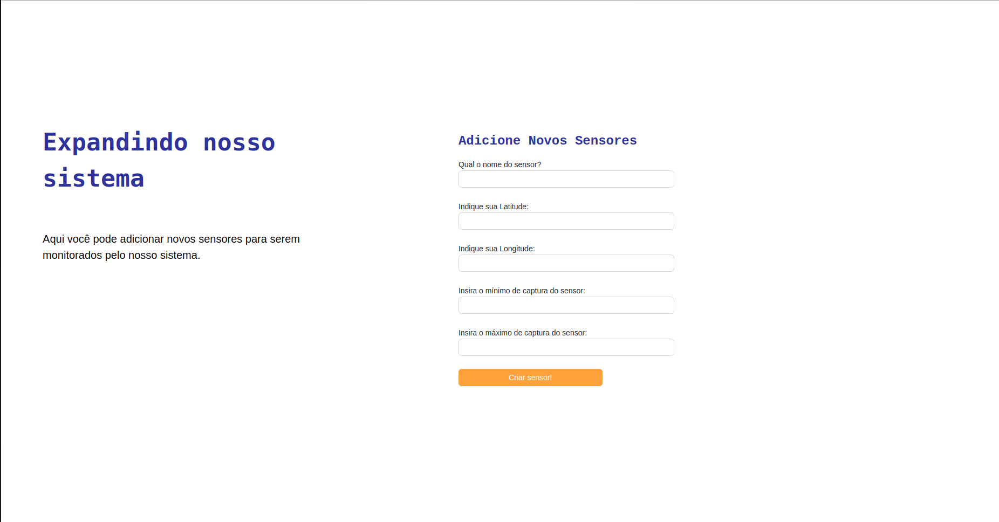
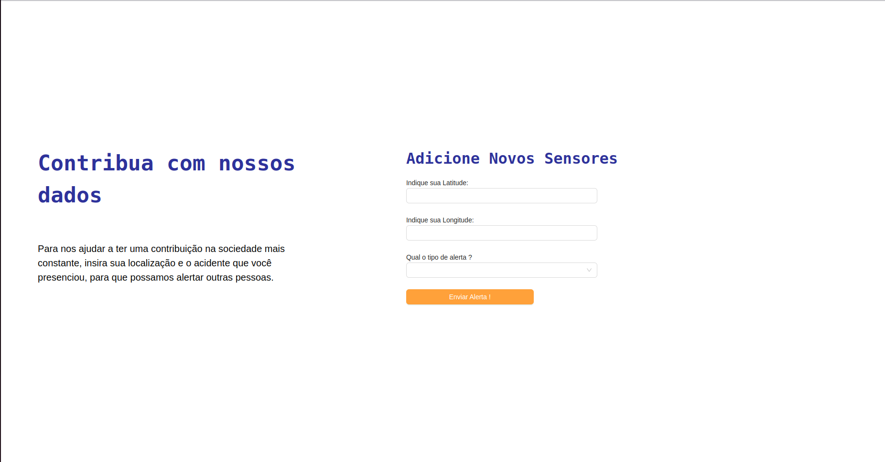

## Introdução

Este documento fornece uma visão geral do frontend desenvolvido para um sistema de login e formulários de envio de dados de alertas e de sensores. O frontend foi construído utilizando Next.js e Ant Design.

O sistema de login permite que os usuários autentiquem-se para acessar as funcionalidades do sistema, enquanto os formulários de envio de dados permitem que os usuários enviem alertas e a criação de novos sensores.

## Desenvolvimento de Wireframe 










## Funcionalidades Desenvolvidas 
1. Sistema de Login/Cadastro de Usuários
2. Envio de Novos Alertas 
3. Criação de Novos Sensores

## Como Executar 
Para rodar o frontend, siga as instruções abaixo:

1. Certifique-se de ter o Node.js instalado em seu sistema.

2. Navegue até o diretório /frontend do seu projeto.

3. Instale as dependências do projeto executando o seguinte comando no terminal:
```
npm install
```

4. Após a instalação das dependências, inicie o servidor de desenvolvimento com o comando:
```
npm run dev
```

5. O frontend estará disponível em http://localhost:3001 no seu navegador.

## Hospedagem e Deploy 
Para facilitar a visualização da interface, foi realizado o deploy do sistema do frontend na Vercel: 
https://2024-t0002-ec-09-g04.vercel.app/


## Demonstração em Vídeo
Assista ao vídeo abaixo para ver uma demonstração do frontend em ação:

<iframe width="560" height="315" src="https://www.youtube.com/embed/RDsDgRaD6Js?si=jlS7O4G5iwEDBxCc" title="YouTube video player" frameborder="0" allow="accelerometer; autoplay; clipboard-write; encrypted-media; gyroscope; picture-in-picture; web-share" allowfullscreen></iframe>


# Integração do Frontend

## Descrição

Este documento descreve a integração do frontend com o backend do sistema, utilizando a biblioteca Axios para comunicação entre plataformas desenvolvidas em JavaScript. A integração visa fornecer uma interface para interação dos usuários com o sistema, permitindo a visualização e manipulação de dados.

## Funcionalidades

O frontend oferece duas principais funcionalidades:

1. **Criação de Estações de Sensores:** Os gestores podem criar estações com os sensores necessários para medir determinadas variáveis em uma região específica. Os dados são enviados em um formato específico, incluindo nome, latitude, longitude e parâmetros de cada sensor.


2. **Alertas de Incidentes:** Os usuários comuns podem enviar alertas relatando incidentes encontrados durante suas atividades. Os dados são enviados em um formato simples, incluindo latitude, longitude e descrição do incidente.


## Formato dos Dados

### Sensores

Os dados dos sensores são enviados no seguinte formato JSON:

```json
{
 "name": "Nome da Estação",
 "latitude": 123.456,
 "longitude": 78.901,
 "params": {
   "co2": { "min": 0, "max": 0, "z": 0 },
   "co": { "min": 0, "max": 0, "z": 0 },
   "no2": { "min": 0, "max": 0, "z": 0 },
   "mp10": { "min": 0, "max": 0, "z": 0 },
   "mp25": { "min": 0, "max": 0, "z": 0 },
   "rad": { "min": 0, "max": 0, "z": 0 }
 }
}
```

### Alertas

Os dados dos alertas são enviados no seguinte formato JSON:

```json
{
 "latitude": 123.456,
 "longitude": 78.901,
 "option": "Descrição do Incidente"
}
```

## Interface de Integração

O frontend oferece duas telas principais:


1. **Tela de Sensores:** Permite que os gestores criem estações de sensores, fornecendo os dados necessários para cada sensor.



2. **Tela de Alertas:** Permite que os usuários comuns enviem alertas relatando incidentes encontrados durante suas atividades.

