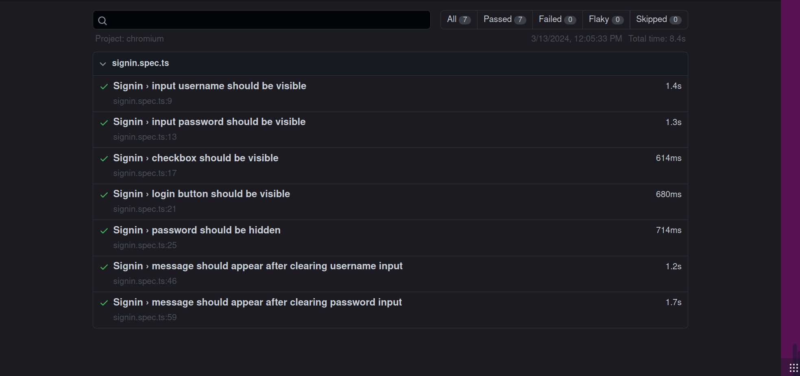

A adoção do TDD (Desenvolvimento Orientado a Testes) é uma prática que oferece inúmeros benefícios no processo de desenvolvimento de software. Além de proporcionar feedback imediato sobre as novas funcionalidades, como mencionado anteriormente, o TDD promove a criação de um código mais limpo. Isso ocorre porque os desenvolvedores escrevem códigos simples, focados na passagem dos testes, resultando em uma base de código mais clara e fácil de manter. Essa abordagem não apenas acelera o ciclo de desenvolvimento, mas também contribui para a sustentabilidade e qualidade a longo prazo do software. Segue abaixo uma breve explicação de como esse projeto implementa isso e as instruções para comprovar a esteira de testes desenvolvida.

## Backend

### Rodar testes

Aqui, todos os comandos necessários estão sendo abstraídos por um arquivo Makefile. Se você tiver curiosidade para saber o que o comando abaixo faz, basta conferir [aqui](https://github.com/Inteli-College/2024-T0002-EC09-G04/blob/main/backend/Makefile#L1).

#### Comando:

```shell
make tests
```

#### Output:

```shell
✔ Container simulation  Started                                                                                                      0.0s 
?       github.com/Inteli-College/2024-T0002-EC09-G04/backend/cmd/app    [no test files]
?       github.com/Inteli-College/2024-T0002-EC09-G04/backend/cmd/simulation     [no test files]
?       github.com/Inteli-College/2024-T0002-EC09-G04/backend/internal/infra/kafka       [no test files]
?       github.com/Inteli-College/2024-T0002-EC09-G04/backend/internal/infra/repository  [no test files]
?       github.com/Inteli-College/2024-T0002-EC09-G04/backend/internal/infra/web [no test files]
?       github.com/Inteli-College/2024-T0002-EC09-G04/backend/internal/usecase   [no test files]
?       github.com/Inteli-College/2024-T0002-EC09-G04/backend/tools      [no test files]
=== RUN   TestNewAlert
--- PASS: TestNewAlert (0.00s)
=== RUN   TestNewLog
--- PASS: TestNewLog (0.00s)
=== RUN   TestEntropy
--- PASS: TestEntropy (0.00s)
=== RUN   TestNewSensor
--- PASS: TestNewSensor (0.00s)
=== RUN   TestNewSensorPayload
--- PASS: TestNewSensorPayload (0.00s)
PASS
coverage: 100.0% of statements
ok      github.com/Inteli-College/2024-T0002-EC09-G04/backend     0.005s  coverage: 100.0% of statements
=== RUN   TestMqttIntegration
2024/03/12 10:33:48 Selecting all sensors from the MongoDB collection sensors
--- PASS: TestMqttIntegration (152.76s)
PASS
coverage: [no statements]
ok      github.com/Inteli-College/2024-T0002-EC09-G04/backend/test       152.771s        coverage: [no statements]
```

:::note
- A esteira de testes definida aqui é responsável por testar as entitdade do ssistema e por realizar um teste de integração garantindo a entrega, e integridade e a frequência de envio dos dados, assim como o QoS da msg.
:::

### Rodar a visualização da cobertura de testes

Novamente, todos os comandos necessários estão sendo abstraídos por um arquivo Makefile. Se você tiver curiosidade para saber o que o comando abaixo faz, basta conferir [aqui](https://github.com/Inteli-College/2024-T0002-EC09-G04/blob/main/backend/Makefile#L31).

:::note
- Em uma cenário real, não precisaríamos de um arquivo como esse porque os sensores seriam criados por um frontend+backend que inseriria no banco de dados dos sensores.
:::

#### Comando:

```bash
make coverage 
```

#### Output:


:::note
- Este comando está criando, a partir do arquivo `coverage_sheet.md`, uma visualização da cobertura de testes nos principais arquivos Go.
:::

### Testes unitários:

O teste TestEntropy avalia se a função Entropy retorna valores dentro do intervalo esperado. O teste TestNewSensor verifica a criação correta de um Sensor. O teste TestNewSensorPayload assegura que a criação de um SensorPayload inicialize corretamente os atributos e que os valores estejam nos intervalos adequados. Há também planos futuros (TODO) para adicionar testes que lidem com casos específicos e parâmetros inválidos.

```golang
package entity

import (
	"testing"
	"time"
)

func TestEntropy(t *testing.T) {
	entropy := Entropy([]float64{0, 100})
	if entropy <= 0 && entropy >= 100 {
		t.Errorf("Entropy should be between 0 and 100")
	}
}

func TestNewSensor(t *testing.T) {
	sensor := NewSensor("name", 0, 0, map[string]Param{"key": {Min: 0, Max: 100, Factor: 0.5}})
	if sensor.Name != "name" {
		t.Errorf("Name should be name")
	}
	if sensor.Latitude != 0 {
		t.Errorf("Latitude should be 0")
	}
	if sensor.Longitude != 0 {
		t.Errorf("Longitude should be 0")
	}
}

func TestNewSensorPayload(t *testing.T) {
	sensorPayload, _ := NewSensorPayload("id", map[string]Param{"key": {Min: 0, Max: 100, Factor: 0.5}}, time.Now())
	if sensorPayload.Sensor_ID != "id" {
		t.Errorf("Sensor_ID should be id")
	}
	if value, ok := sensorPayload.Data["key"].(float64); ok {
		if !(value <= 180 && value >= 0) {
			t.Errorf("Invalid value for Data['key'], expected outside the range %v and %v, got %v", 0, 100, value)
		}
	} else {
		t.Errorf("Invalid type for Data['key']")
	}
}

func TestNewSensorPayloadParams(t *testing.T) {
	_, err := NewSensorPayload("id", map[string]Param{"key": {Min: 0, Max: 100, Factor: 0.5}}, time.Now())
	if err != nil {
		t.Errorf("Error should be nil")
	}
}

func TestNewSensorPayloadTimestamp(t *testing.T) {
	sensorPayload, _ := NewSensorPayload("id", map[string]Param{"key": {Min: 0, Max: 100, Factor: 0.5}}, time.Now())
	if sensorPayload.Timestamp.IsZero() {
		t.Errorf("Timestamp should not be zero")
	}

	if sensorPayload.Timestamp.After(time.Now()) {
		t.Errorf("Timestamp should be before now")
	}

	if sensorPayload.Timestamp.Before(time.Now().Add(-time.Minute * 10)) {
		t.Errorf("Timestamp should be within the last 10 minutes")
	}

}

func TestNewSensorInvalidId(t *testing.T) {
	_, err := NewSensorPayload("", map[string]Param{"key": {Min: 0, Max: 100, Factor: 0.5}}, time.Now())
	if err == nil {
		t.Errorf("Error should not be nil")
	}
}

func TestNewSensorPayloadConfidenceInterval(t *testing.T) {
	params := map[string]Param{
		"key": {Min: 10, Max: 12, Factor: 1.96},
	}
	timestamp := time.Now()

	payload, err := NewSensorPayload("sensorID", params, timestamp)
	if err != nil {
		t.Fatalf("Failed to generate sensor payload: %v", err)
	}

	for key, param := range params {
		value, ok := payload.Data[key].(float64)
		if !ok {
			t.Fatalf("Generated value for %s is not a float64", key)
		}

		mean := float64(param.Min+param.Max) / 2
		stdDev := (float64(param.Max-param.Min) / 2) / param.Factor
		confidenceIntervalLower := mean - (param.Factor * stdDev)
		confidenceIntervalUpper := mean + (param.Factor * stdDev)

		if value < confidenceIntervalLower || value > confidenceIntervalUpper {
			t.Errorf("Value for %s (%v) is outside the confidence interval [%v, %v]", key, value, confidenceIntervalLower, confidenceIntervalUpper)
		}
	}
}
```
Este teste avalia a função NewLog do pacote entity. Ele cria uma instância de Log com valores específicos e, em seguida, verifica se os atributos Sensor_ID e Data são inicializados corretamente. Se algum desses valores não estiver de acordo com as expectativas, o teste emite uma mensagem de erro indicando a discrepância. O teste tem como objetivo assegurar que a função de criação de logs esteja produzindo objetos com os valores desejados.

```golang
package entity

import (
	"testing"
	"time"
)

func TestNewLog(t *testing.T) {
	log := NewLog("id", map[string]interface{}{"key": "value"}, time.Now())
	if log.Sensor_ID != "id" {
		t.Errorf("Sensor_ID should be id")
	}
	if log.Data["key"] != "value" {
		t.Errorf("Data should be value")
	}
}
```

Este teste verifica a função NewAlert do pacote entity. Ele cria uma instância de Alert com valores específicos e, em seguida, verifica se os atributos Latitude, Longitude e Option são inicializados corretamente. Se algum desses valores não estiver de acordo com as expectativas, o teste emite uma mensagem de erro indicando a discrepância. O teste tem o objetivo de garantir que a função de criação de alertas esteja produzindo objetos com os valores desejados.

```golang
package entity

import (
	"testing"
)

func TestNewAlert(t *testing.T) {
	alert := NewAlert(0, 0, "")
	if alert.Latitude != 0 {
		t.Errorf("Latitude should be 0")
	}
	if alert.Longitude != 0 {
		t.Errorf("Longitude should be 0")
	}
	if alert.Option != "" {
		t.Errorf("Option should be empty")
	}
}
```

### Testes de integração:
Os testes de integração até agora implementados, tem como objetivo avaliar os seguintes pontos: QoS ( Se a mensagem é transmitida dentro do sistema com o QoS definido inicialmente ), Frequência de envio das mensagens ( As mensagens estão sendo enviadas na frequência definida, com uma margem de erro razoável? ), Integridade das mensagens ( A estrutura as mensagens se modifica durante a o processo transmissão? ). Para encontrar mais detalhes sobre a implementação dos testes de integração, acesse o [arquivo](https://github.com/Inteli-College/2024-T0002-EC09-G04/blob/main/backend/test/integration_mqtt_test.go).

### Apêndice

Testes automatizados são essenciais no desenvolvimento de software, integrados com ferramentas de CI/CD para proporcionar uma abordagem consistente e eficiente. Essa prática permite identificar rapidamente problemas, reduzir erros e acelerar o ciclo de entrega, resultando em software de maior qualidade e lançamentos mais rápidos e confiáveis. Implementamos uma primeira versão dessa estrategia, para mais detalhes acesse o [workflow de testes](https://github.com/Inteli-College/2024-T0002-EC09-G04/blob/main/.github/workflows/tests.yml) do Github Actions.

## Frontend

Com o intuito de garantir a qualidade do produto final e a sua integridade, foram desenvolvidos testes para a interface do usuário, que permitem a validação da usabilidade do sistema da forma que ele foi projetado.

### Ferramentas Utilizadas

Para a realização dos testes, foi utilizado o Playwright, uma ferramenta de automação de testes de interface de usuário que permite a execução de testes em navegadores web. O Playwright é uma ferramenta de código aberto que oferece suporte a vários navegadores, como Google Chrome, Microsoft Edge e Mozilla Firefox. Dessa forma, é possível garantir que o sistema seja testado em diferentes ambientes, garantindo a sua compatibilidade e acessibilidade.

### Testes Realizados

Para essa sprint, foram desenvolvidos testes principalmente para a validação do sistema de login, signup e criação de um novo alerta. A seguir, são apresentados os testes realizados e os resultados obtidos.



### Testes pendentes

Entretanto, ainda há testes que estão apresentando falhas, uma vez que o sistema ainda não apresenta as funcionalidades implementadas. Porém, de acordo com a metodologia TDD, os testes são desenvolvidos antes da implementação das funcionalidades, de forma que, após a implementação, os testes possam ser executados novamente para garantir que as funcionalidades foram implementadas corretamente.

### Conclusão

O frontend está apresentando o comportamento esperado até o presente momento, restando apenas a implementação das funcionalidades para que os testes possam ser executados novamente e validados. Com isso, é possível garantir que o sistema está funcionando corretamente e que as funcionalidades estão funcionando como planejadas.