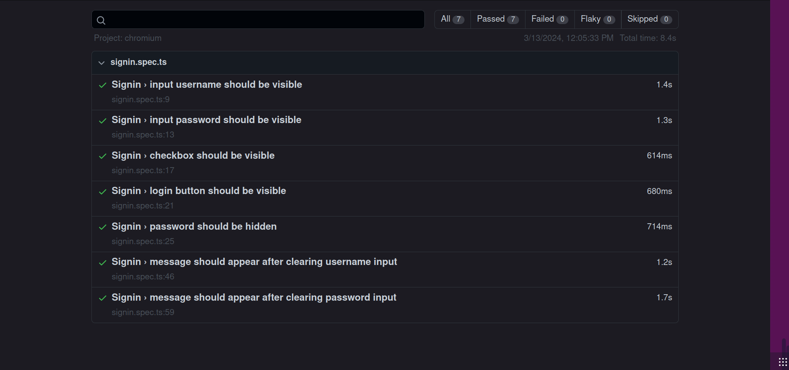

## Introdução

Com o intuito de garantir a qualidade do produto final e a sua integridade, foram desenvolvidos testes para a interface do usuário, que permitem a validação da usabilidade do sistema da forma que ele foi projetado.

## Ferramentas Utilizadas

Para a realização dos testes, foi utilizado o Playwright, uma ferramenta de automação de testes de interface de usuário que permite a execução de testes em navegadores web. O Playwright é uma ferramenta de código aberto que oferece suporte a vários navegadores, como Google Chrome, Microsoft Edge e Mozilla Firefox. Dessa forma, é possível garantir que o sistema seja testado em diferentes ambientes, garantindo a sua compatibilidade e acessibilidade.

## Testes Realizados

Para essa sprint, foram desenvolvidos testes principalmente para a validação do sistema de login, signup e criação de um novo alerta. A seguir, são apresentados os testes realizados e os resultados obtidos.

## Testes pendentes

Entretanto, ainda há testes que estão apresentando falhas, uma vez que o sistema ainda não apresenta as funcionalidades implementadas. Porém, de acordo com a metodologia TDD, os testes são desenvolvidos antes da implementação das funcionalidades, de forma que, após a implementação, os testes possam ser executados novamente para garantir que as funcionalidades foram implementadas corretamente.

## Conclusão

O frontend está apresentando o comportamento esperado até o presente momento, restando apenas a implementação das funcionalidades para que os testes possam ser executados novamente e validados. Com isso, é possível garantir que o sistema está funcionando corretamente e que as funcionalidades estão funcionando como planejadas.
