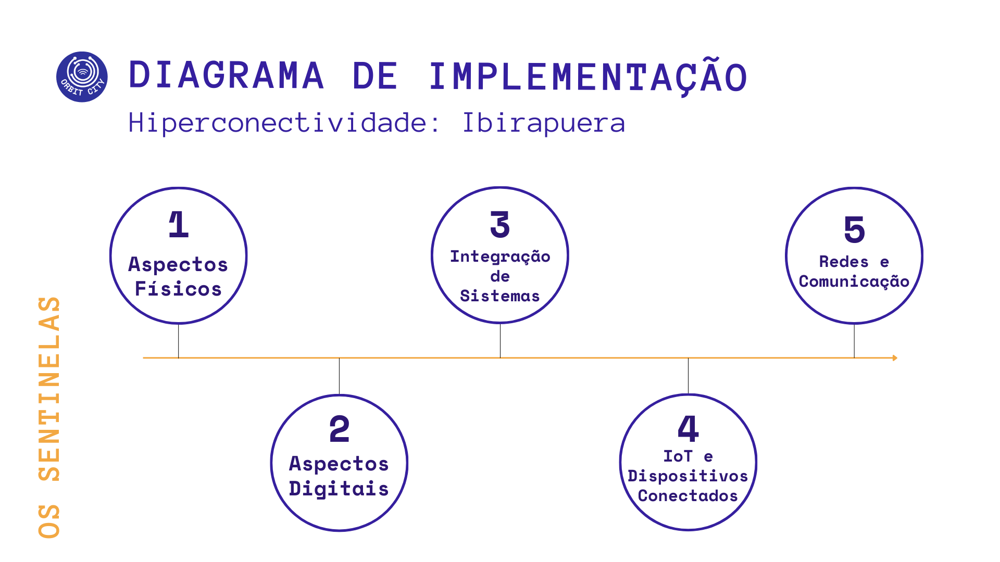
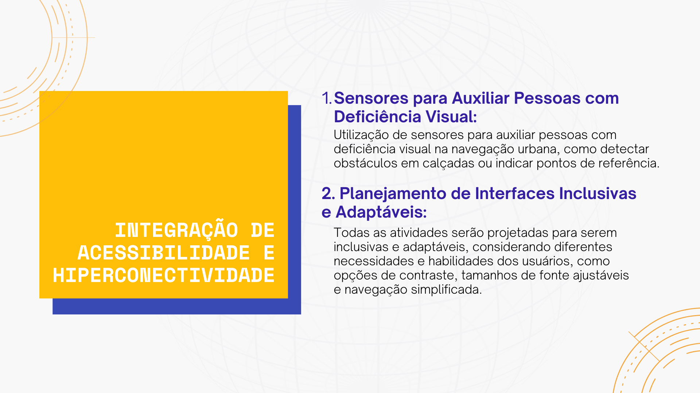

# Proposta de Planejamento de Hiperconectividade
Na era atual, marcada por avanços tecnológicos significativos e pela crescente conscientização sobre a importância da inclusão, as cidades inteligentes surgem como um conceito revolucionário destinado a remodelar a vida urbana. Neste contexto, a hiperconectividade e acessibilidade assumem papéis centrais, promovendo não apenas a eficiência e segurança urbanas, mas também garantindo que todos os cidadãos, independentemente de suas habilidades, possam desfrutar igualmente dos benefícios da vida na cidade. O Parque Ibirapuera, um dos pulmões verdes e espaços culturais mais valorizados de São Paulo, Brasil, serve como um exemplo ideal para explorar como um espaço pode se transformar através da integração de tecnologias de informação e comunicação, tornando-se um ambiente hiperconectado que prioriza a acessibilidade e a inclusão.

## 1. Descrição do Espaço/Produto/Plataforma
<strong>Parque Ibirapuera - São Paulo, Brasil</strong>

<strong>Função Principal:</strong> 
O Parque Ibirapuera serve como um centro de recreação, cultura e lazer, oferecendo aos cidadãos de São Paulo um espaço verde para práticas esportivas, eventos culturais e momentos de lazer.

<strong>Público-alvo:</strong> 
Todos os cidadãos e visitantes de São Paulo, incluindo famílias, atletas, turistas, e pessoas com deficiência.

<strong>Localização:</strong> São Paulo, SP, Brasil.

## 2. Avaliação de Acessibilidade Atual
### Aspectos Físicos:
- Entradas e saídas são parcialmente acessíveis, com algumas barreiras físicas que dificultam o acesso por pessoas com mobilidade reduzida.
- Mobilidade interna enfrenta desafios devido a caminhos irregulares e falta de sinalização tátil para deficientes visuais.

### Aspectos Digitais:
O site oficial e aplicativos associados não são totalmente compatíveis com leitores de tela e faltam opções de personalização para diferentes necessidades de acessibilidade.

## 3. Planejamento de Hiperconectividade

### Integração de Sistemas:
- Conectar sistemas de iluminação, segurança (câmeras inteligentes), informações ao visitante e sistemas de gestão de tráfego nas adjacências para uma experiência coesa.
- IoT e Dispositivos Conectados:
Instalar sensores de qualidade do ar, câmeras de segurança inteligentes, quiosques interativos e assistentes virtuais acessíveis por voz para informações e emergências.
- Redes e Comunicação:
Implementar redes Wi-Fi gratuitas e infraestrutura de rede 5G para suportar a conectividade de dispositivos e sistemas em todo o parque.

## 4. Integração de Acessibilidade e Hiperconectividade
### Propostas de Melhoria:
- Sensores no chão para orientação de pessoas com deficiência visual, emitindo sinais sonoros e táteis para guiar o caminho.
- Desenvolvimento de aplicativos e quiosques com interfaces de usuário adaptativas, incluindo ajustes para contraste, tamanho de texto e compatibilidade com leitores de tela.

## 5. Reflexão Final
A implementação de tecnologias de hiperconectividade no Parque Ibirapuera, alinhada com práticas de acessibilidade, tem o potencial de transformar significativamente a experiência dos visitantes, tornando o parque um modelo de inclusão e sustentabilidade. Esse planejamento enfatiza a importância de considerar as necessidades de todos os usuários desde o início do design, promovendo uma cidade mais inclusiva. As principais lições aprendidas incluem a necessidade de integração contínua entre tecnologia e design inclusivo, e como a hiperconectividade pode ser uma ferramenta poderosa para melhorar a acessibilidade em espaços públicos.