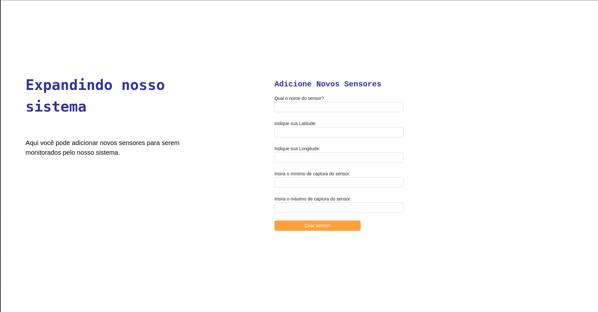
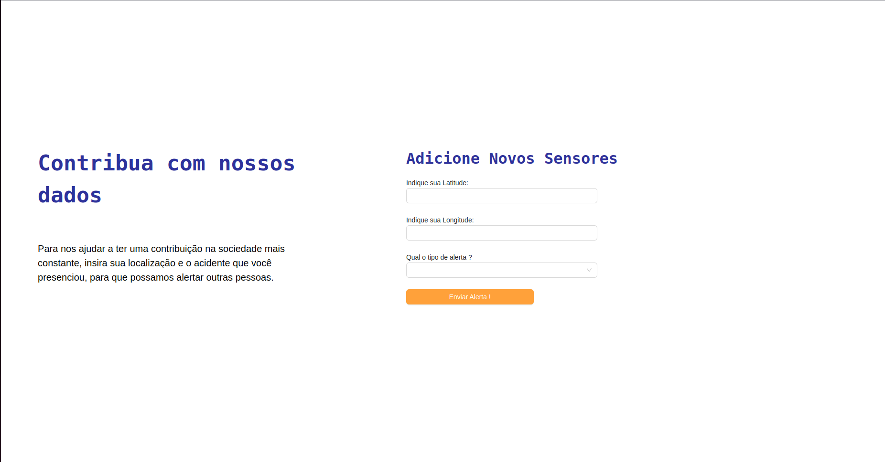

# Integração do Frontend

## Descrição

Este documento descreve a integração do frontend com o backend do sistema, utilizando a biblioteca Axios para comunicação entre plataformas desenvolvidas em JavaScript. A integração visa fornecer uma interface para interação dos usuários com o sistema, permitindo a visualização e manipulação de dados.


## Funcionalidades

O frontend oferece duas principais funcionalidades:


1. **Criação de Estações de Sensores:** Os gestores podem criar estações com os sensores necessários para medir determinadas variáveis em uma região específica. Os dados são enviados em um formato específico, incluindo nome, latitude, longitude e parâmetros de cada sensor.


2. **Alertas de Incidentes:** Os usuários comuns podem enviar alertas relatando incidentes encontrados durante suas atividades. Os dados são enviados em um formato simples, incluindo latitude, longitude e descrição do incidente.


## Formato dos Dados


### Sensores


Os dados dos sensores são enviados no seguinte formato JSON:


```json
{
 "name": "Nome da Estação",
 "latitude": 123.456,
 "longitude": 78.901,
 "params": {
   "co2": { "min": 0, "max": 0, "z": 0 },
   "co": { "min": 0, "max": 0, "z": 0 },
   "no2": { "min": 0, "max": 0, "z": 0 },
   "mp10": { "min": 0, "max": 0, "z": 0 },
   "mp25": { "min": 0, "max": 0, "z": 0 },
   "rad": { "min": 0, "max": 0, "z": 0 }
 }
}
```

### Alertas

Os dados dos alertas são enviados no seguinte formato JSON:

```json
{
 "latitude": 123.456,
 "longitude": 78.901,
 "option": "Descrição do Incidente"
}
```

## Interface de Integração

O frontend oferece duas telas principais:


1. **Tela de Sensores:** Permite que os gestores criem estações de sensores, fornecendo os dados necessários para cada sensor.



2. **Tela de Alertas:** Permite que os usuários comuns enviem alertas relatando incidentes encontrados durante suas atividades.
