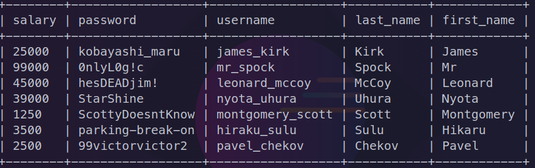

## Introdução

Com o intuito de nos fazer refletir sobre a segurança do projeto, foi proposta uma atividade em que deveríamos aprender mais sobre as técnicas de segurança e vulnerabilidades que podem ser encontradas em um sistema web. Para isso, nos foi apresentado uma atividade em que deveríamos explorar um sistema de login e identificar como podemos obter acesso a informações que não deveriam ser acessíveis a qualquer usuário.

## Ferramentas Utilizadas

Para a realização da atividade, foi explorado um sistema de login desenvolvido em PHP, que utiliza um banco de dados MySQL para armazenar as informações dos usuários, e para o deploy, foi utilizado o NGINX.

## Testes realizados

### Primeiro Teste

Para o primeiro teste, foi utilizado um método de injeção de SQL que realiza o dump de todos os usuários, apresentando a informação dos seus salários. Para isso, foi inputado o seguinte valor no campo de usuário:

```sql
' OR 1=1#
```

Os detalhes de funcionamento desse comando estão detalhados a seguir:

* ' OR: Aqui, a aspa simples ('), seguida por "OR", sugere uma inserção de condição lógica em uma consulta SQL. O "OR" é um operador lógico usado para combinar duas ou mais condições em uma expressão. Nesse contexto, sugere-se a adição de uma condição adicional à consulta SQL.

* 1=1: Esta é uma expressão lógica verdadeira em SQL. Quando 1 é igual a 1, a expressão é sempre verdadeira. Portanto, isso está sendo usado para garantir que a condição adicionada com o operador "OR" seja sempre verdadeira.

* #: O símbolo # é frequentemente usado para iniciar um comentário em SQL. Qualquer coisa depois disso será ignorada pelo interpretador SQL. Isso é útil para encerrar qualquer consulta SQL que esteja sendo injetada no sistema e evitar erros de sintaxe.

O resultado obtido foi a listagem de todos os usuários e seus salários, como pode ser visto na imagem a seguir:


### Segundo Teste

Para o segundo teste, foi utilizado um método de injeção de SQL que obtém a senha de todos os usuários cadastrados no sistema. Para isso, foi inputado o seguinte valor no campo de usuário:

```sql
' UNION SELECT username,password FROM users#
```

Os detalhes de funcionamento desse comando estão detalhados a seguir:

* UNION SELECT: A cláusula UNION em SQL é usada para combinar os resultados de duas ou mais consultas SELECT em uma única tabela de resultados. Esta parte do comando sugere uma união do resultado de uma consulta legítima com outro conjunto de dados que eles estão tentando extrair. O SELECT indica que eles querem selecionar certas colunas de dados.

* username,password: Aqui, estão sendo especificadas as colunas que desejam selecionar, visando obter os nomes de usuário e senhas armazenadas no banco de dados.

* FROM users: Esta parte indica a seleção dos dados da tabela chamada "users", onde estão armazenadas as informações de usuário e senha.

* #: Assim como no comando anterior, o símbolo # é usado para iniciar um comentário em SQL, o que significa que tudo após ele será ignorado pelo interpretador SQL. Isso é feito para encerrar a consulta SQL e evitar erros de sintaxe.


### Utilização da ferramenta SQLMap

Além dos testes realizados de forma manual, também foi utilizado a ferramenta SQLMap para realizar testes de injeção de SQL. O SQLMap é uma ferramenta de teste de penetração que automatiza o processo de detecção e exploração de falhas de injeção de SQL. Ele é capaz de detectar e explorar várias falhas de injeção de SQL, como injeção de SQL cega, injeção de SQL baseada em erro, injeção de SQL baseada em tempo, injeção de SQL booleana, entre outras.

Para realizar o teste, foi utilizado o seguinte comando:

```bash
python sqlmap.py -u http://localhost:8080/ --batch --banner --method POST --forms --dump
```

O resultado obtido foi a listagem de todos os usuários e suas senhas, como pode ser visto na imagem a seguir:




## Possíveis vulnerabilidades e ataques ao sistema

No caso de uma autenticação com senhas simples ou com padrões facilmente decifráveis, o sistema fica exposto à vulnerabilidades como ataques que ferem a confidencialidade, disponbilidade ou integridade do sistema. A fim de mitigar possíveis falhas ou situações que comprometem a aplicação, métodos como a autenticação via OAuth 2.0, JWT (JSON Web Tokens) e AWS Cognito oferecem camadas adicionais de segurança.

## Autenticação via OAuth 2.0

O OAuth 2.0 é um protocolo de autorização amplamente adotado que permite a delegação segura de acesso a recursos protegidos sem a necessidade de compartilhar senhas. Ao implementar OAuth 2.0, o sistema pode aproveitar os fluxos de autorização padrão, como o fluxo de concessão de código de autorização e o fluxo implícito, que garantem uma comunicação segura entre os clientes e o servidor de autorização.

### Mitigação de vulnerabilidades

- **Proteção contra ataques de injeção de SQL**: 

Como o OAuth 2.0 não requer o compartilhamento direto de senhas entre clientes e servidores, os ataques de injeção de SQL que exploram vulnerabilidades em senhas armazenadas são mitigados. Em vez disso, os tokens de acesso são utilizados para autorização, reduzindo significativamente a exposição a esses ataques.

- **Segurança na gestão de tokens:** 

O OAuth 2.0 utiliza tokens de acesso com prazos de validade limitados e escopos definidos, o que reduz a janela de oportunidade para possíveis ataques. Além disso, as implementações de OAuth 2.0 geralmente incluem mecanismos robustos de revogação de tokens em caso de comprometimento.

## Autenticação via JWT (JSON Web Tokens)

Os tokens JWT oferecem uma maneira eficiente e segura de transmitir informações de autenticação entre o cliente e o servidor. Ao usar JWT para autenticação, o sistema pode garantir a integridade e autenticidade dos dados do usuário, além de mitigar ataques comuns, como a interceptação de tokens.

### Mitigação de vulnerabilidades

- **Prevenção de ataques de interceptação de tokens:** 

Os tokens JWT são assinados digitalmente pelo servidor, garantindo que qualquer tentativa de alteração nos dados seja detectada. Isso protege contra ataques de interceptação de tokens, nos quais um invasor tenta modificar os tokens durante a transmissão.


- **Redução de vulnerabilidades de gerenciamento de sessão:** 

Ao contrário das sessões tradicionais, que são armazenadas no servidor, os tokens JWT são autocontidos e podem ser validados sem a necessidade de acesso ao armazenamento do servidor. Isso reduz a exposição a vulnerabilidades de gerenciamento de sessão, como a sessão fixa ou a falha de sessão.

## Autenticação via AWS Cognito

O AWS Cognito é um serviço de autenticação totalmente gerenciado fornecido pela Amazon Web Services (AWS), que oferece uma maneira simplificada de adicionar autenticação, autorização e gerenciamento de usuários às aplicações web e móveis. Ao utilizar o AWS Cognito, o sistema pode aproveitar a infraestrutura segura e escalável da AWS para proteger as informações dos usuários

### Mitigação de vulnerabilidades

- **Segurança na gestão de identidade:** 

O AWS Cognito oferece recursos avançados de segurança, como autenticação multifator (MFA), que adiciona uma camada adicional de proteção às contas dos usuários. Além disso, o AWS Cognito suporta integração com provedores de identidade externos, como o Google, Facebook e Amazon, para autenticação federada.

- **Proteção contra ataques de força bruta:** 

O AWS Cognito inclui recursos integrados de proteção contra ataques de força bruta, como limites de tentativas de login e bloqueio de contas após um número especificado de tentativas fracassadas. Isso ajuda a mitigar ataques de força bruta que visam adivinhar as credenciais dos usuários.

## Conclusão

A atividade nos permitiu entender a importância de se preocupar com a segurança de um sistema, e como é importante realizar testes de segurança para garantir que o sistema não esteja vulnerável a ataques. Através dos testes realizados, foi possível observar o quão fácil é explorar um sistema desprotegido, e como devemos focar nossos esforços em garantir que o sistema esteja seguro.
Além disso, a utilização de métodos avançados de autenticação, como OAuth 2.0, JWT e AWS Cognito, podem ajudar a mitigar várias vulnerabilidades comuns associadas à autenticação tradicional com senhas simples. Ao adotar essas tecnologias, o sistema pode garantir a confidencialidade, integridade e disponibilidade dos dados do usuário, protegendo contra uma variedade de ataques maliciosos. É fundamental priorizar a segurança da autenticação ao projetar e desenvolver sistemas web, especialmente aqueles que lidam com informações sensíveis dos usuários.