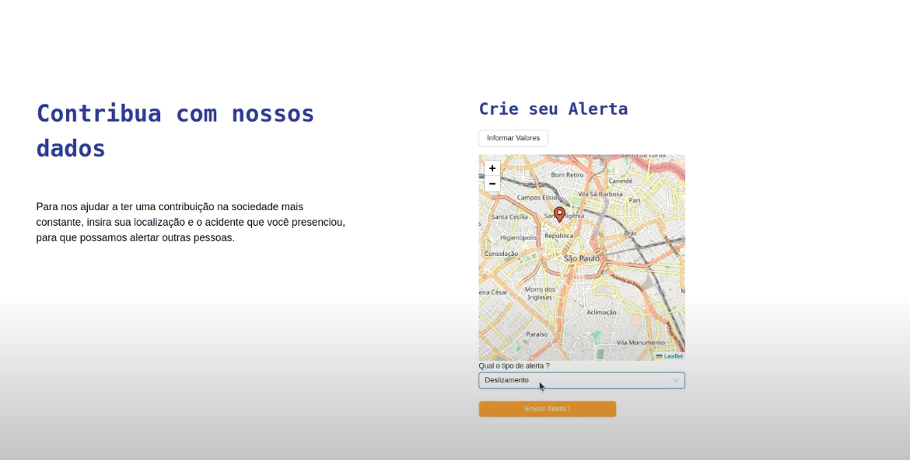

## Melhorias na Interface Web

A seguir falaremos um pouco sobre algumas das ações realizadas durante a sprint para o aprimoramento da interface desenvolvida. Pensando em duas interfaces existentes atualmente. Uma inicial que visa a inclusao de dados e interação com usuários. E outra que tem como foco principal a visualização dos dados por meio de analises gráficas. 

Na documentação abaixo, focaremos nas implementações de aprimoramento da interface web, que tem foco na inclusão e inserção de novos dados e também no sistema de login e autenticação dos usuários. 

## Funcionalidades Aprimoradas 

### Feedbacks para o Usuário - Sistema de Login e Cadastro

Com o objetivo de aprimorar a experiência do usuário e garantir uma interface mais amigável, implementamos feedbacks visuais durante os processos de login e cadastro. Esses feedbacks são projetados para fornecer uma resposta imediata ao usuário sobre a conclusão bem-sucedida de suas ações, tornando o processo mais transparente e intuitivo. Durante o login, o usuário é notificado sobre o sucesso da autenticação, enquanto durante o cadastro, recebe confirmação sobre a criação bem-sucedida da conta. Esses feedbacks contribuem significativamente para a usabilidade do sistema, fornecendo orientações claras e reduzindo a possibilidade de erros.

#### Exemplos de Feedbacks de Sucesso:

### Usabilidade dos Inputs de Dados de Localidade

Com base no feedback dos usuários e em nossa análise de usabilidade, identificamos oportunidades de aprimoramento na inserção de dados de localidade para criação de alertas. Anteriormente, os usuários precisavam fornecer manualmente as coordenadas de latitude e longitude do local do alerta, o que podia ser desafiador para aqueles menos familiarizados com esse formato. Para simplificar esse processo e melhorar a usabilidade, desenvolvemos uma funcionalidade interativa utilizando um mapa. Agora, os usuários podem facilmente selecionar a localização do alerta no mapa, eliminando a necessidade de inserção manual de coordenadas. Essa abordagem intuitiva não só reduz a possibilidade de erros, mas também torna o sistema mais acessível para todos os usuários, independentemente de seu nível de experiência.

#### Exemplo de Interação com Mapa para Inserção de Alerta:

### Demonstração 

<iframe width="560" height="315" src="https://www.youtube.com/embed/ksPyfoVVPQ8?si=VPRYxyKxNueYIY_v" title="YouTube video player" frameborder="0" allow="accelerometer; autoplay; clipboard-write; encrypted-media; gyroscope; picture-in-picture; web-share" referrerpolicy="strict-origin-when-cross-origin" allowfullscreen></iframe>