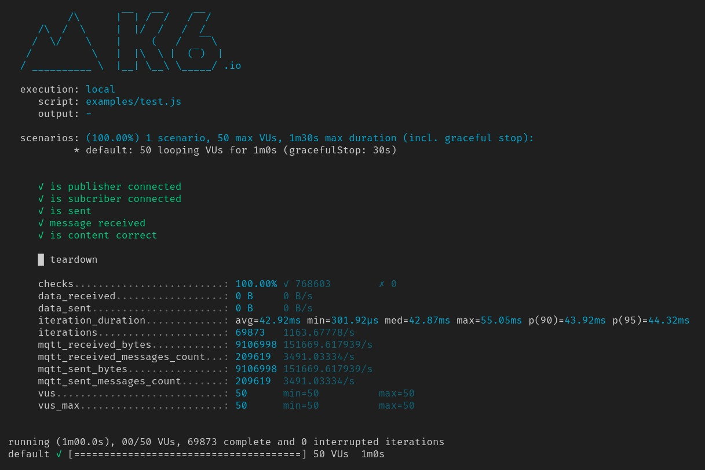

## Introdução

Este documento detalha a execução de testes de performance realizados durante a sprint 4, com ênfase em testes de carga para avaliar a capacidade da infraestrutura desenvolvida pelo grupo ao longo do módulo. O objetivo era verificar se a estrutura poderia suportar a demanda prevista de sensores. No início da sprint, optamos por uma estimativa inicial para obter uma ideia da magnitude do desafio. A estratégia adotada foi dividir a área do município de São Paulo em quilômetros quadrados e distribuir os sensores pelos quarteirões, resultando na decisão de implantar quatro sensores por quarteirão, totalizando 6084 sensores. Esta quantia foi adotada como base para os testes subsequentes.

## Desafios Decorrentes da Escolha Arquitetônica

A decisão por uma arquitetura inteiramente baseada em cloud, abrangendo desde o broker até a mensageria, proporcionou uma maior escalabilidade horizontal e distribuição do sistema. Contudo, essa escolha impôs limitações, especialmente para testes, devido ao uso de planos gratuitos nos serviços de cloud, que restringem o número de requisições. Isso nos levou a um ponto de estrangulamento, onde ultrapassar um determinado limite de requisições resultava na inutilização da conta para fins de teste.

Em resposta a essa limitação, consideramos a possibilidade de criar um cluster totalmente dockerizado da arquitetura. No entanto, a falta de familiaridade com a tecnologia de testes e o tempo restrito impediram a implementação dessa solução, levando a equipe a concentrar os testes dentro dos limites permitidos pela versão gratuita do hivemq, que suporta até 100 requisições simultâneas.

## Utilização do K6 para Testes de Carga

Diante do desafio de realizar nosso primeiro teste de carga, a equipe optou pelo K6, um framework baseado em Go que executa scripts de teste escritos em Javascript e suporta integração com Grafana para monitoramento. O processo de teste envolve a definição de variáveis pré-estabelecidas e de ambiente, permitindo testes tanto em ambientes locais quanto em cloud. Para nossos testes na cloud, configuramos variáveis como host, usuário e senha. Ao executar o script, o K6 gera várias instâncias do script para simular o número desejado de clientes, publishers ou subscribers, alcançando o limite de 100 conexões imposto pelo nosso plano hivemq. Ao concluir a execução, o script fornece um relatório no console com os resultados do teste, incluindo o tempo de execução e o número de clientes simulados.

## Script em funcionamento

A fim de rodar o teste específico que usamos, basta trocar as variáveis de ambiente para uma conta Hivemq e executar o seguinte comando:

```bash
./k6 run --vus 50 --duration 10s test.js
```

Com isso, após os 10 segundos de duração do teste, o resultado esperado deve ser assim:

**K6:**


Nesse sentido, vale citar que se a conta em questão for gratuíta, algo sobre extrapolação deve aparecer na tela inicial do hivemq.

## Conclusão

Em suma, a implementação desse teste de carga nessa sprint teve foco na descoberta de como o grupo poderia fazer esse teste de carga. O maior tempo gasto para a atividade foi na área de pesquisa, procurando sobre quais eram as melhores ferramentas e métodos para fazer o teste. Por fim, cabe ressaltar que o objetivo do grupo para a sprint 5 é melhorar o teste de carga, com testes em uma arquitetura local dockerizada, ferramentas integradas de visualização com o grafanna, quantidade de cliente condizente com a expectativa e evolução do teste até chegar em um de estress.

