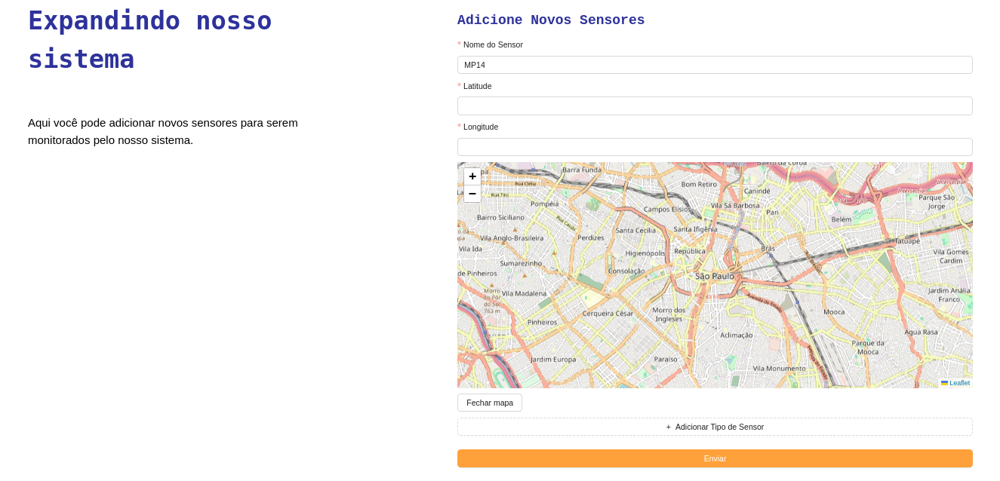
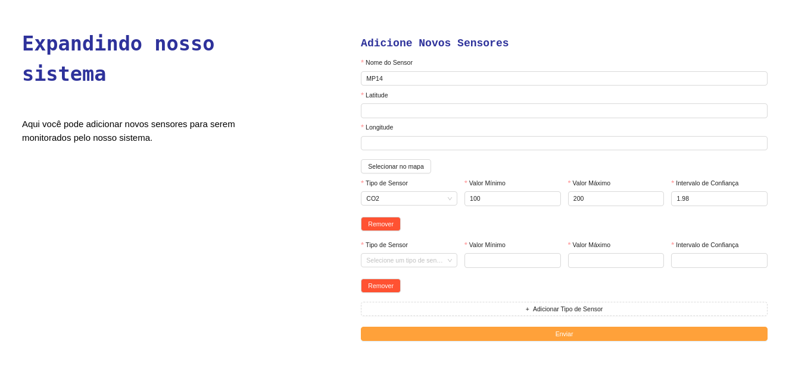

## Documentação da Sprint 5 - Melhorias Contínuas na Interface Web

Durante a sprint 5, focamos em refinar ainda mais a interface web, com especial atenção na página de criação de sensores. Nosso objetivo era tornar a experiência do usuário ainda mais fluida e intuitiva, otimizando a forma como os dados são inseridos e permitindo uma maior flexibilidade na configuração dos sensores. Abaixo, detalhamos as principais melhorias implementadas.

### Reformulação da Página de Criação de Sensores
Identificamos que a experiência de adicionar novos sensores ao sistema poderia ser aprimorada para oferecer maior simplicidade e eficiência aos usuários. Com base nessa percepção, realizamos uma série de atualizações na página de criação de sensores, focando na reorganização dos inputs de dados e na adição de funcionalidades que permitem uma gestão mais dinâmica dos sensores.

### Novidades na Interface de Criação de Sensores:
Organização Compacta dos Inputs: Redesenhamos a distribuição dos campos de entrada na interface, agrupando-os de forma mais lógica e compacta. Isso não só otimiza o espaço da tela, como também torna o processo de inserção de dados mais rápido e menos propenso a erros.

<b>Adição de Tipos de Sensores de Gás:</b> Introduzimos a possibilidade de adicionar diferentes tipos de leitores de gás para um mesmo sensor. Isso oferece aos usuários a flexibilidade de monitorar múltiplos indicadores ambientais com um único dispositivo.

<b>Funcionalidade de Adicionar e Excluir Sensores:</b> Implementamos botões interativos que permitem aos usuários adicionar novos tipos de sensores e remover os existentes conforme necessário. Essa funcionalidade assegura que a configuração dos sensores possa ser facilmente ajustada a qualquer momento, melhorando a gestão dos dispositivos.

<b>Demonstração das Novas Funcionalidades:</b>

O usuário pode escolher a localização pelo mapa, todavia está presente a opção para inserção manual devido a um valor mais específico.

Dessa maneira é possível criar um novo tipo de sensor e também removê-lo.

Com essas atualizações, buscamos não apenas aumentar a eficiência na coleta de dados ambientais, mas também garantir que a plataforma seja inclusiva e acessível para todos os usuários.